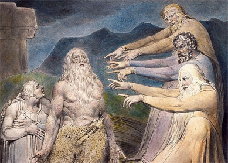

# Job1:1-12

---
[Job Chapter 1](https://cdn.mintz5.com/801A6BD/linode/bible/JOB/1)

### Notes


1. Describing Job
  * He feared God and [eschewed](https://www.merriam-webster.com/dictionary/eschew) evil
   Its interesting the Bible describes Job as perfect, but  we obviously know that he too was a sinner. Was this because we walked with God?
   This is before one could be made perfect through the forgiveness of sins to which Jesus paid on the cross.
   
   * He was a father and husband
   * He was very wealthy
   *
2. What was the purpose of letting Satan loose on Job?


[Now there was a day when the sons of God came to present themselves before the LORD, and Satan came also among them.](https://cdn.mintz5.com/801A6BD/linode/bible/JOB/1/6?json=false)

We will all stand before God at some point in time. This is reality. 
Think about that day when God will ask me for an account. 
Yes I am saved by Jesus Christ finished work, but the simple thought of standing before the creator of everything is a nice and sobering wake up call.

Its significant to me that Job would ** rose up early in the morning and offered..**
Maybe ask yourself what do you do early in the morning. What is the first thing you tend to think about when you wake from your sleep?

* Remember that Satan does walk up and down the earth. Its also sobering that Satan still walks about the earth.
  Are you putting on your armor daily?
  Just yesterday, i know iv sinned with my mouth.
  The bible teaches to pray without ceasing.
  Walk in the spirit.
  
# The Take Away
* Fear God
* You will stand before the almighty God
* Purpose to avoid evil
```json
{
  "Book": "PROVERBS",
  "Chapter": 22,
  "Verse": 3,
  "Text": "A prudent man foreseeth the evil, and hideth himself: but the simple pass on, and are punished."
  }
```
* Pray and love for others (its not about you)
* God can protect his own, and he can (and will) sometimes allow bad things to happen even if you are actually doing everything right.
* So far every time Satan speaks, he speaks in questions. He tends to lean on cofusion and doubt. [See all the places Satan speaks..](https://cdn.mintz5.com/801A6BD/linode/bible/search?n=10000&q=satan&json=true)
* Trust God, he always good.

I havent got there yet in the reading, but it comes to mind. people will always let you down. People **will** always let you down. Its ok. you will let people down too. 
Just trust God, seek him, have a health reverance and fear of God. 

Thats all for now.
