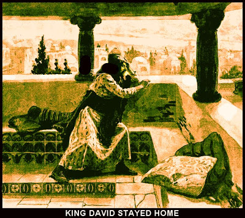

```
pastor brian dunlop
location: Lighthouse Baptist Church
```



# Find a Place (Being where you should be or not being where you shouldnt be)

[Proverbs 27:8](http://cdn.mintz5.com/801A6BD/linode/bible/PROVERBS/27/8?json=false)
```json
8 As a bird that wandereth from her nest, so is a man that wandereth from his place.
```
---
## Notes
* The bird finds safety and rest in their nest  
* Just as there is a place for birds, there is a place for man  

* [2Sam:11](http://cdn.mintz5.com/801A6BD/linode/bible/2samuel/11)
  * [David got into trouble b/c he was not doing/being where he was supposed to be/do](http://cdn.mintz5.com/801A6BD/linode/bible/2samuel/11/2?json=false)
    He tarried still in Jerussalem when he should not have been there
    * David paid a high pice

* Prov 21:16
```
16 The man that wandereth out of the way of understanding shall remain in the congregation of the dead.
```
* Take note of the word **place** in [Deut:12](http://localhost:8000/bible/DEUTERONOMY/12)  

[search API on the work place](https://cdn.mintz5.com/801A6BD/linode/bible/search?n=1000&q=place)


* Its not a pick what you think is right relationship  
  ```
      8 Ye shall not do after all the things that we do here this day, every man whatsoever is right in his own eyes.
  ```

2Peter2:10  
People are self willed..  
The people were not 
```

```

* Jude1:8 following the desires of the heart  
```
16 These are murmurers, complainers, walking after their own lusts; and their mouth speaketh great swelling words, having men's persons in admiration because of advantage.
```

- The original sin was choosing to do his own thing.   
- Every sin comes down to that, doing what **you** want  

We wanna be in charge!!  

* Judges 21:25  
Every man did that  which was right in their own eyes.
```
JUDGES 21 : 25
In those days there was no king in Israel: every man did that which was right in his own eyes.
```

you MUST worship him in truth!   
not according to your desires or thoughts.  
its HIS truth  
```
JOHN 4:23

But the hour cometh, and now is, when the true worshippers shall worship the Father in spirit and in truth: for the Father seeketh such to worship him.  
```

* 1Cor 1:18  
    People might think its foolish to have to worship God in church.. but God told us it would be percieved that way  
```
1CORINTHIANS 1:18

For the preaching of the cross is to them that perish foolishness; but unto us which are saved it is the power of God.

1CORINTHIANS 1:21

For after that in the wisdom of God the world by wisdom knew not God, it pleased God by the foolishness of preaching to save them that believe.
```

Watching church on TV isnt even close..  

Bible believing churches are getting rare  
    
Romans 1:20 they are without excuse.  
there foolish heart was darkened.  
```
ROMANS 1:25

Who changed the truth of God into a lie, and worshipped and served the creature more than the Creator, who is blessed for ever. Amen.
```
__Pastor gives many examples of churches that are preaching about being kind to plants and such__   


Even watching this churches live stream != how God wants worship per his word (the bible)  

Isaiah 53:6  
we have went our own ways
```
ISAIAH 53 : 6
All we like sheep have gone astray; we have turned every one to his own way; and the LORD hath laid on him the iniquity of us all.
```

---
### Take Away

Remember that church is Gods idea  
Always ask yourself, are you where you __should__ be  ?
Working late? Sleeping in?  
Beware of idle time  
Trust God and not your own understanding  


